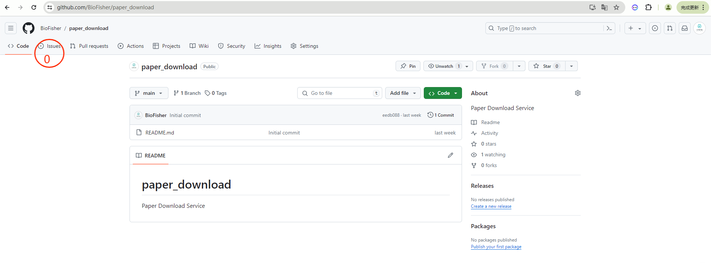
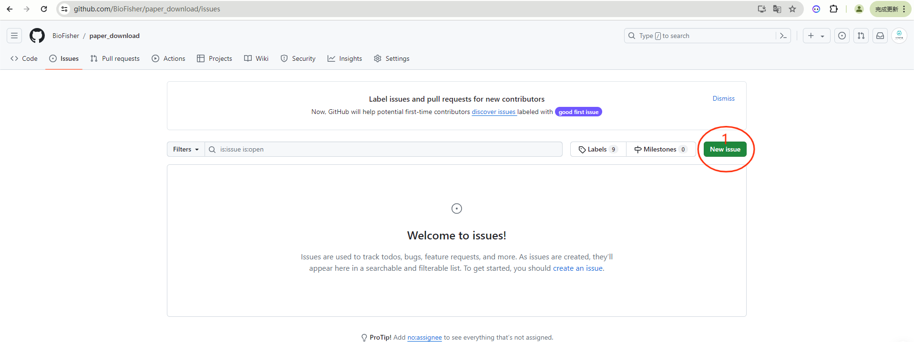
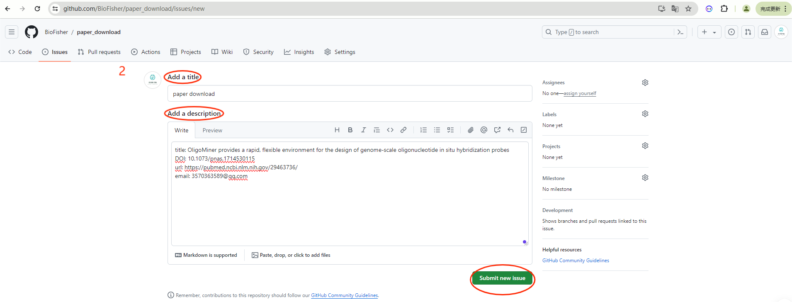
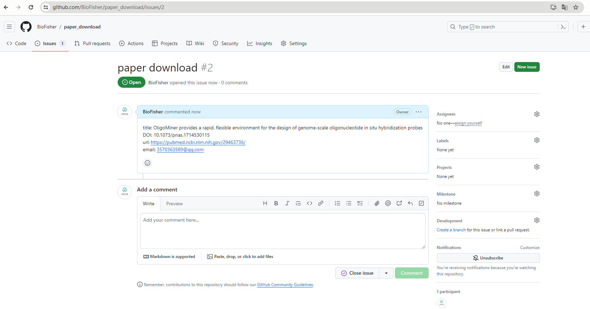
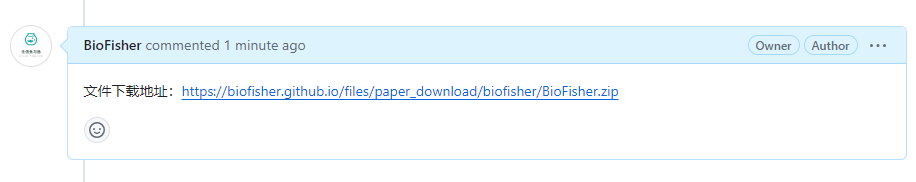
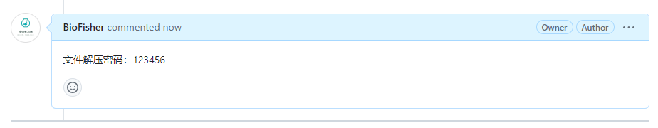

# paper_download

文献是一切科研的基础！

## 文献属性

- title：文献的名称

- DOI：DOI的全称为“Digital Object Unique Identifier”, 中文意思即: 数字对象唯一标识符, 可以理解为数字资源唯一的”身份证号码“, 专门用来标记参考文献, 书籍资源和学术报告内容等等

- URL：文献的网页链接，如NCBI链接等

## 文献下载服务

我们提供文献下载服务，5RMB/篇。首篇8折，货到付款，量大从优！

注意：无论山崩地裂，无论海枯石烂，24小时内一定会回复您！

### QQ用户

我们的QQ：3570363589

直接添加QQ沟通即可！！！

  

### 小红书

我们的小红书：生信鱼与渔

直接添加小红书沟通即可！！！

  

### 邮件用户

我们的邮箱：3570363589@qq.com

1. 给我们的邮箱发送您需要下载文献的属性信息，包括但不限于title、DOI、URL。

2. 您将收到回复邮件，我们会以附件的形式将文献压缩文件回复邮件到您的邮箱。

3. 您需要[支付宝](./images/Alipay.jpg)转账，并备注您的邮箱

4. 您将第二次收到回复邮件，我们会提供解压密码，用于解压文献

注意：您的邮箱是我们唯一的沟通方式，切勿填错！！！

### GitHub用户

github地址：https://github.com/BioFisher/paper_download

1. 打开项目地址，并在项目中进入Issues

  

2. 新建issue

  

3. 填写文献信息

  

4. 提交issue

  

5. 提供下载链接

  

6. 您需要[支付宝](./images/Alipay.jpg)转账，并备注您的github呢称

7. 提供解压密码

  

注意：如果此处提供了邮箱信息，您的邮箱将收到压缩文件，类似邮箱用户操作即可！！！

